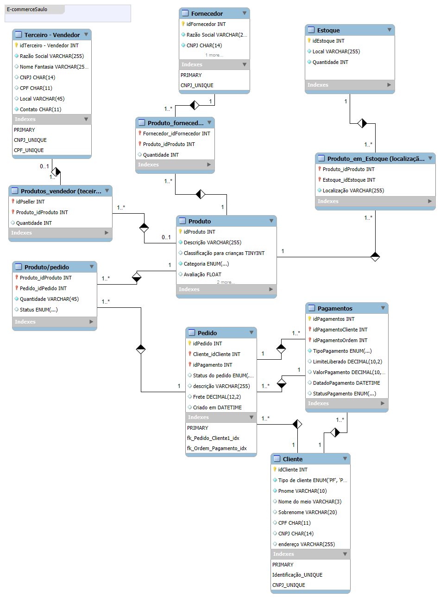

## Road Map para resolução do desafio

-Comecei pelas orientações da instrutora seguindo o passo a passo dos videos, 
-Depois implementei a tabela de pagamentos e o desafio de clientes com CPF ou CNPJ mas sem a possibilidade de entrar com os dois, 
-Alterei os valores monetários para Decimal devido ao problema conhecido de cálculos monetários em Float darem algum tipo de erro de arredondamento

Segue o schema: 